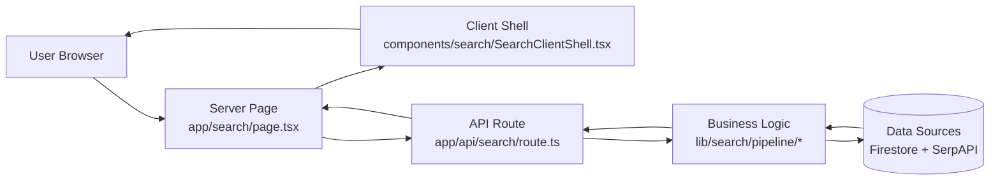
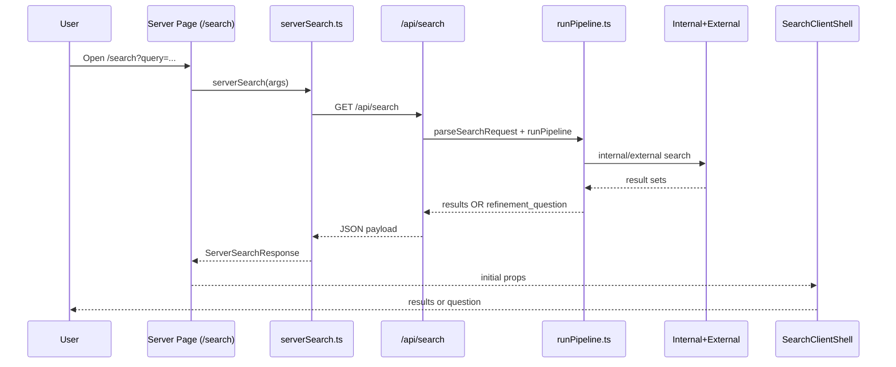

# Search Architecture Baseline

This document captures the current search architecture baseline for `apps/web`, why recent changes were made, known issues, and the next upgrade path.

## 0) Idea Origin

| Idea from draft | Status in code today |
| --- | --- |
| Move from monolithic search logic to modular pipeline | Implemented (`lib/search/pipeline/*`) |
| Server Page -> Client Shell separation | Implemented (`app/search/page.tsx` + `SearchClientShell.tsx`) |
| Conversational refinement flow | Implemented (rule-based follow-up questions) |
| Provider abstraction (`auto`, `shopping`, `organic`) | Implemented (heuristic selection) |
| Internal + external result blending | Implemented |
| Result quality evaluation gate before asking next question | Partially implemented (basic heuristics only) |
| Vertical-aware missing-slot strategy | Not implemented yet (typed contracts added) |
| Smart next-question engine (`inferVertical -> getMissingImportantSlots -> evaluateResults -> chooseNextQuestion`) | Not implemented yet (planned next phase) |

## 1) What Changed

1. Search typing is now centralized in `apps/web/src/lib/search/types.ts`.
2. `SearchClientShell` and `serverSearch` now use shared canonical search types instead of ad-hoc local type shapes.
3. `/search` page is now driven by a server-side orchestration flow:
   `SearchPage -> serverSearch -> /api/search -> runPipeline`.
4. Conversational refinement (follow-up question mode) is now part of the baseline flow using `searchState`, `refinementField`, and `refinementValue`.
5. Future-oriented types for the next refinement generation were added:
   `SearchVertical`, `MissingImportantSlots`, `ResultQuality`, and function contracts for
   `inferVertical`, `getMissingImportantSlots`, `evaluateResults`, and `chooseNextQuestion`.

## 2) Why These Changes Were Made

1. Remove type drift and eliminate shell-level type errors.
2. Make server and client use the same contract for result data and refinement questions.
3. Support conversational search rounds without losing state between requests.
4. Prepare for next-step smarter questioning with explicit typed contracts before implementation.
5. Keep current behavior stable while enabling incremental upgrades.

## 3) Visual Architecture Guide (For New Developers)

### A. Core Next.js Pattern We Follow

Main architecture rule:
`Server Page -> Client Component (Shell) -> API Route -> Business Logic in lib`

- Server page should fetch/prepare data.
- Client component should handle UI interaction/state.
- API route should parse/validate transport I/O only.
- `lib/*` should hold business logic and decision-making.

### B. Layer Diagram



### C. Request Sequence (What Happens Per Search)



### D. Responsibility Matrix

| Layer | Owns | Should avoid |
| --- | --- | --- |
| `app/search/page.tsx` (Server Page) | URL param parsing + initial data fetch | Client UI state logic |
| `SearchClientShell.tsx` (Client) | Rendering, click handlers, navigation | Core ranking/refinement business rules |
| `app/api/search/route.ts` (API route) | Request parsing, calling pipeline, response formatting | Heavy domain logic |
| `lib/search/pipeline/*` (Business logic) | Provider selection, state/refinement updates, query strategy | UI concerns |
| `lib/search/internal|external` | Data retrieval adapters | Page/UI orchestration |

### E. Folder Map (Mental Model)

```text
apps/web/src/
  app/
    search/page.tsx                  # Server page entry
    api/search/route.ts              # API adapter
  components/search/
    SearchClientShell.tsx            # Client shell UI
  lib/search/
    serverSearch.ts                  # Server-side orchestration for /search page
    types.ts                         # Shared contracts
    pipeline/
      parseSearchRequest.ts          # HTTP -> typed request
      runPipeline.ts                 # Core search orchestration
      refinements.ts                 # Refinement/state logic
      debug.ts                       # Trace/timing helpers
    internal/simpleInternalSearch.ts # Internal marketplace source
    external/serpapi*.ts             # External provider sources
```

### F. Common Mistake To Avoid

Do not put business decision logic in UI components.
If logic answers questions like "what provider?", "what question next?", or "how to merge/rank results?", it belongs in `lib/search/*`, not in React components.

## 4) Current Request Flow

### A. UI entry

1. User lands on `/search` with query params (`query`, optional `searchState`, optional refinement fields).
2. `apps/web/src/app/search/page.tsx` parses params and calls `serverSearch(...)`.

### B. Server orchestration

1. `apps/web/src/lib/search/serverSearch.ts` creates `traceId`/`searchId`, normalizes state, and calls `/api/search`.
2. It forwards:
   `q`, `provider=auto`, `source=both`, `searchState`, `lastUserMessage`, and optional refinement inputs.
3. It normalizes API response into either:
   `results` (`SearchResults`) or `refinementQuestion` (`RefinementQuestion`).

### C. API and pipeline

1. `apps/web/src/app/api/search/route.ts` parses request via `parseSearchRequest`.
2. `apps/web/src/lib/search/pipeline/runPipeline.ts` runs:
   internal search (`simpleInternalSearch`) and external search (SerpAPI shopping/organic).
3. If conversational mode is active, `decideRefinementQuestion(...)` may return a follow-up question.
4. API returns one of:
   `SearchResultsResponse` or `RefinementQuestionResponse`.

### D. Render round-trip

1. `SearchClientShell` renders server-provided results or refinement options.
2. Choosing a refinement option pushes a new URL with updated `searchState`, `refinementField`, and `refinementValue`.
3. That triggers another server round with state preserved.

## 5) Canonical Types (Current Source of Truth)

All core search contracts live in:
`apps/web/src/lib/search/types.ts`

Important exported types:

1. Request/transport: `SearchRequest`, `SearchResponse`, `SearchResultsResponse`, `RefinementQuestionResponse`.
2. State/model: `SearchState`, `SearchRefinementField`, `SearchIntent`, `Condition`, `PriceIntent`.
3. Results: `SearchResults`, `SearchSummary`, `InternalResult`, `ExternalResult`.
4. Shell contracts: `ServerSearchResponse`, `ClientSearchResults`, `ServerSearchResults`, `ClientRefinementQuestion`, `ServerRefinementQuestion`.
5. Next-gen planning: `SearchVertical`, `MissingImportantSlots`, `ResultQuality`, and related function type aliases.

## 6) Current Behavior (Baseline)

1. Provider selection is heuristic:
   `auto -> organic|shopping` based on state intent and query text signals.
2. Refinement questions are rule-based in `pipeline/refinements.ts`.
3. Search combines internal marketplace results and external SerpAPI results.
4. Summary is currently optional and usually `null` in this path.
5. Search debug logs are available via `debugSearch=1` and trace ids.

## 7) Known Issues / Risks

1. Biggest current gap: refinement questions are still too generic and not sufficiently tailored to the specific item being searched.
   Example: if the user searches from a cylinder-head image, the system should ask for high-value fitment details like engine model/type (for example `Caterpillar C12`) instead of generic prompts.
2. Dual search stacks still exist:
   new `/api/search` and legacy `/api/universal-search` are both present in codebase.
3. `useConversationalSearch` and some API routes still call `/api/universal-search`, which can diverge behavior from `/search`.
4. `runPipeline.ts` still uses `any[]` for interim result arrays, reducing type safety inside the pipeline.
5. `SearchClientShell` encodes `searchState` manually before putting it into `URLSearchParams`; this works with current decoding but is brittle and easy to regress.
6. `serverSearch` currently calls `/api/search` via HTTP even though both are in the same app; this adds network overhead and duplicated serialization.
7. Observability persistence is stubbed:
   `logSearchEvent(...)` has no Firestore write yet.
8. No dedicated automated tests currently protect the conversational state loop and response shape branching.
9. There are stale references in local workflow context to `apps/web/src/components/search/types/search.ts`, but that file is not present in current tree.

## 8) Recommended Upgrade Plan

### Phase 1 (stability)

1. Consolidate onto one search API path (`/api/search`) and deprecate `/api/universal-search`.
2. Replace `any[]` with `InternalResult[]` and `ExternalResult[]` throughout pipeline internals.
3. Normalize `searchState` query encoding/decoding to a single strategy (no double-encoding behavior).
4. Implement test coverage for:
   `results vs refinement_question` branching, state carry-forward, and refinement application.

### Phase 2 (quality)

1. Implement the typed next-question engine:
   `inferVertical -> getMissingImportantSlots -> evaluateResults -> chooseNextQuestion`.
2. Make refinement questions domain-tailored and slot-driven so the system asks the most useful missing detail for the item category.
   Example target behavior: for a cylinder head query/image, ask for engine family/model compatibility (for example `Caterpillar C12`, `C15`, etc.) to improve relevance and conversion.
3. Add typed ranking/relevance scoring across internal + external sources.
4. Add summary generation and include `summary` in `SearchResultsResponse.data`.
5. Introduce result quality thresholds by vertical to reduce low-signal result pages.

### Phase 3 (performance and ops)

1. Consider direct in-process pipeline invocation from `serverSearch` (or shared service layer) to avoid internal HTTP call.
2. Add caching by query + normalized `SearchState`.
3. Implement persistent analytics events with trace correlation.
4. Add dashboard-level metrics: refinement rate, zero-result rate, click-through by source, and latency percentiles.

## 9) Environment and Debug Notes

1. External search needs `SERPAPI_API_KEY`.
2. Image query extraction endpoint (`/api/search/image`) needs `GEMINI_API_KEY` (or `NEXT_PUBLIC_GEMINI_API_KEY`).
3. Debug search logs can be enabled with `debugSearch=1` in query params.

## 10) Baseline Status

1. This is the current base implementation and type contract for ongoing search work.
2. Type errors in `SearchClientShell` and `serverSearch` related to missing search types have been resolved by moving to shared canonical types.
3. Next development should build on `lib/search/types.ts` first, then update pipeline behavior to match those contracts.
