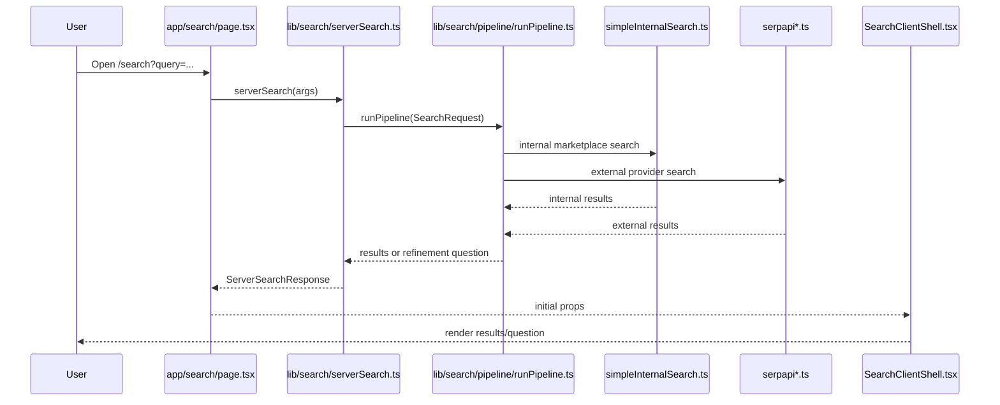
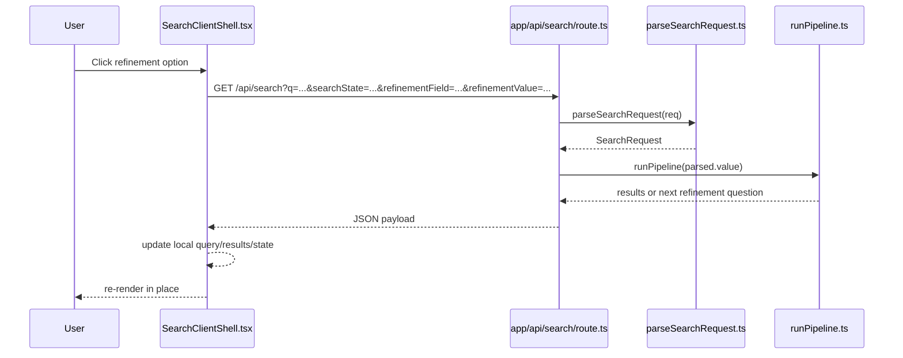

# Search Refinement Upgrade README

This document explains the search-system changes that were recently implemented in `apps/web`, why they were made, how the new flow works, and where to extend it safely.

This is the current developer-facing reference for the upgraded `/search` experience.

## 1) What Changed

The search flow is no longer just "user query in, generic results out".

It now has four major upgrades:

| Area | What changed | Why it matters |
| --- | --- | --- |
| Query understanding | Deterministic query normalization and alias inference were added before retrieval | Prevents avoidable questions like asking the brand for `macbook` |
| Refinement quality | Refinement questions are now vertical-aware and product-specific | Broad searches like `laptop`, `phone`, `camera`, `sofa`, `bike`, and `dress shoes` now ask better narrowing questions |
| Query application | Refinement answers now rewrite the active search query before the next retrieval round | Answering a question actually changes the results |
| Performance | The internal server-to-server HTTP hop was removed, and refinement answers now run client-side without full page navigation | Lower latency and smoother follow-up interactions |

## 2) High-Level Before vs After

### Before

```mermaid
flowchart LR
  U[User]
  P[/search page]
  SS[serverSearch]
  API[/api/search]
  RP[runPipeline]
  UI[SearchClientShell]

  U --> P
  P --> SS
  SS --> API
  API --> RP
  RP --> API
  API --> SS
  SS --> P
  P --> UI
  UI --> U
```

- Initial page load used an internal HTTP call from `serverSearch` to `/api/search`
- Refinement answers triggered `router.push(...)`
- The next page load re-ran the whole route
- Some refinement answers updated state but did not reliably update retrieval query

### After

```mermaid
flowchart LR
  U[User]
  P[/search page]
  SS[serverSearch]
  RP[runPipeline]
  UI[SearchClientShell]
  API[/api/search]

  U --> P
  P --> SS
  SS --> RP
  RP --> SS
  SS --> P
  P --> UI
  UI --> U
  U --> UI
  UI --> API
  API --> RP
  RP --> API
  API --> UI
  UI --> U
```

- Initial page search now calls `runPipeline(...)` directly from `serverSearch`
- Refinement answers stay on the page and fetch `/api/search` directly
- The visible query, state, refinement prompt, and results update in place
- URL is kept in sync with `history.replaceState(...)`

## 3) End-User Behavior Changes

### A. Obvious one-to-one product families are inferred early

Examples:

| User query | New inferred behavior |
| --- | --- |
| `macbook` | infer `brand=Apple`, `category=electronics`, rewrite to `Apple macbook` |
| `macbok` | same as `macbook` |
| `iphone` | infer Apple electronics family |
| `ipad` | infer Apple electronics family |
| `galaxy` | infer Samsung electronics family |
| `pixel` | infer Google electronics family |

This logic lives in:

- `apps/web/src/lib/search/pipeline/queryUnderstanding.ts`
- `apps/web/src/lib/search/state.ts`

### B. Broad shopping queries ask better first questions

Examples:

| User query | First likely refinement |
| --- | --- |
| `laptop` | "What kind of laptop are you looking for?" |
| `phone` | "What matters most for the phone you want?" |
| `camera` | "What kind of camera are you shopping for?" |
| `shoes` | "What kind of shoes are you looking for?" |
| `dress shoes` | "What kind of dress shoes do you need?" |
| `sofa` | "What kind of sofa are you looking for?" |
| `bike` | "What kind of bike are you after?" |

This logic lives in:

- `apps/web/src/lib/search/pipeline/refinementEngine/verticalSchemas.ts`
- `apps/web/src/lib/search/pipeline/refinementEngine/chooseNextQuestions.ts`

### C. Refinement answers now modify retrieval, not just state

Example flow:

```text
laptop
-> answer: Gaming / heavy performance
-> deterministic rewrite includes usage intent
-> next search round uses the refined query/state
-> results shift toward gaming/performance-oriented items
```

This logic lives in:

- `apps/web/src/lib/search/pipeline/runPipeline.ts`
- `apps/web/src/lib/search/pipeline/refinementEngine/rewriteQuery.ts`

## 4) Current Search Architecture

### A. Initial page load



### B. Refinement answer flow



## 5) Core Modules And Responsibilities

| File | Responsibility |
| --- | --- |
| `apps/web/src/app/search/page.tsx` | Parses route params and SSR-loads the initial `/search` page state |
| `apps/web/src/components/search/SearchClientShell.tsx` | Renders results, asks refinement questions, handles in-place refinement fetches |
| `apps/web/src/app/api/search/route.ts` | Thin transport adapter that parses request and calls the pipeline |
| `apps/web/src/lib/search/serverSearch.ts` | SSR orchestration for initial page render; now calls `runPipeline` directly |
| `apps/web/src/lib/search/state.ts` | Normalizes search state and defines canonical `model` handling |
| `apps/web/src/lib/search/pipeline/queryUnderstanding.ts` | Deterministic alias inference and early query normalization |
| `apps/web/src/lib/search/pipeline/runPipeline.ts` | Main search orchestrator: state update, provider choice, search execution, refinement, rewrite |
| `apps/web/src/lib/search/pipeline/refinements.ts` | Applies refinement answers to `SearchState` |
| `apps/web/src/lib/search/pipeline/refinementEngine/verticalSchemas.ts` | Declares category-specific slots, questions, trigger rules, and options |
| `apps/web/src/lib/search/pipeline/refinementEngine/chooseNextQuestions.ts` | Chooses the next best refinement question |
| `apps/web/src/lib/search/pipeline/refinementEngine/rewriteQuery.ts` | Builds deterministic rewrite from search state and refinement answers |
| `apps/web/src/lib/search/internal/simpleInternalSearch.ts` | Internal marketplace retrieval and scoring |
| `apps/web/src/lib/search/external/serpapiShopping.ts` | Google Shopping provider adapter |
| `apps/web/src/lib/search/external/serpapiOrgnaic.ts` | Google Organic provider adapter |

## 6) State Model Changes

`SearchState.model` is now the canonical model field.

Backward compatibility remains:

- legacy callers may still send `attributes.model`
- normalization promotes that value into top-level `model`
- old URLs and older search-state payloads still work

The normalization helpers live in:

- `apps/web/src/lib/search/state.ts`

## 7) How Query Evolution Works Now

### Step 1: Raw query enters the system

Example:

```text
macbok
```

### Step 2: Query understanding normalizes obvious aliases

Example:

```text
rawQuery = "macbok"
inferred brand = "Apple"
inferred category = "electronics"
queryRewrite = "Apple macbook"
```

### Step 3: Search runs

The pipeline runs internal and external search against the normalized query and state.

### Step 4: Refinement may ask a question

Example:

```text
query = "laptop"
question = "What kind of laptop are you looking for?"
options = ["Cost-effective", "Everyday use", "High performance", ...]
```

### Step 5: Answer is applied to state and query

Example:

```text
rawQuery = "laptop"
answer = "Gaming / heavy performance"
attributes.usage_profile = "Gaming / heavy performance"
deterministic rewrite includes usage profile
```

### Step 6: Next retrieval uses the refined query

This is the critical difference from the earlier implementation.

## 8) What Improved For Performance

### A. Internal HTTP hop removed

Old:

```text
serverSearch -> fetch('/api/search') -> runPipeline
```

New:

```text
serverSearch -> runPipeline
```

Why this matters:

- removes extra serialization/deserialization
- removes local network stack overhead
- reduces initial SSR search latency

### B. Refinement answers no longer cause full page navigation

Old:

```text
Click answer -> router.push('/search?...') -> route reload -> SSR rerender
```

New:

```text
Click answer -> fetch('/api/search?...') -> local state update -> in-place rerender
```

Why this matters:

- faster perceived response
- less React tree churn
- less SSR overhead for every refinement step

## 9) Product-Specific Refinement Inventory

These are the notable product-first questions now present in the schema.

| Vertical | Field | Example question |
| --- | --- | --- |
| electronics | `usage_profile` | What kind of laptop are you looking for? |
| electronics | `phone_focus` | What matters most for the phone you want? |
| electronics | `camera_use` | What kind of camera are you shopping for? |
| fashion | `shoe_type` | What kind of shoes are you looking for? |
| fashion | `dress_shoe_style` | What kind of dress shoes do you need? |
| home | `sofa_style` | What kind of sofa are you looking for? |
| sports | `bike_type` | What kind of bike are you after? |

These refinement fields are intentionally stored in `SearchState.attributes` so the system can grow without redefining the top-level state shape for every new product family.

## 10) Debugging Notes

Use `debugSearch=1` on `/search` to inspect logs.

Places to watch:

- `serverSearch.start`
- `serverSearch.pipeline.request`
- `serverSearch.pipeline.response`
- `pipeline.start`
- `pipeline.query_understanding`
- `pipeline.internal.done`
- `pipeline.external.done`
- `pipeline.refinement.ask`
- `pipeline.done`

Questions to ask when debugging:

| Symptom | First place to inspect |
| --- | --- |
| Wrong brand question asked | `queryUnderstanding.ts` and `pipeline.query_understanding` logs |
| Good question asked but results unchanged | `rewriteQuery.ts` and `runPipeline.ts` |
| Broad query asks irrelevant subtype question | `verticalSchemas.ts` trigger keywords and `chooseNextQuestions.ts` |
| SSR search feels slow | `serverSearch.ts`, external provider latency, internal Firestore scan cost |
| Refinement click feels slow | client network timing for `/api/search`, external provider latency |

## 11) Known Limitations

The current system is meaningfully better, but not finished.

Remaining constraints:

| Limitation | Impact |
| --- | --- |
| `simpleInternalSearch.ts` still loads and scores up to 200 active listings in memory | Internal search cost will rise with marketplace size |
| External providers are still network-bound | SerpAPI latency can dominate end-to-end response time |
| No dedicated automated test suite yet for the conversational search loop | Regression risk remains higher than it should be |
| Summary generation is still minimal in this pipeline | Search intelligence is stronger than search summarization right now |
| URL sync for in-place refinement uses `replaceState` | Faster UX, but browser history is intentionally flattened during follow-up answers |

## 12) Safe Extension Rules For Developers

If you are extending this system:

1. Put business logic in `lib/search/*`, not in React components.
2. Add new product-specific questions in `verticalSchemas.ts` first.
3. Make sure a new refinement field actually influences `rewriteQuery.ts`.
4. If a field needs special read behavior, update:
   - `state.ts`
   - `getMissingImportantSlots.ts`
   - `chooseNextQuestions.ts`
5. If you add new broad-query logic, define both:
   - trigger keywords
   - query keywords that already satisfy the slot
6. Preserve backward compatibility for `searchState` where practical.

## 13) Suggested Manual QA Checklist

Run these flows in the browser:

1. Search `macbook` and confirm no brand question is asked.
2. Search `macbok` and confirm typo normalization still behaves like `macbook`.
3. Search `laptop` and confirm the first question is laptop-use oriented.
4. Answer `Gaming / heavy performance` and confirm the query and results update in place.
5. Search `phone` and confirm the phone-priority question appears.
6. Search `camera` and confirm camera-intent question appears.
7. Search `shoes` and confirm the generic shoe-type question appears.
8. Search `dress shoes` and confirm the dress-shoe-specific question appears instead of the generic shoe question.
9. Search `sofa` and confirm sofa-style refinement appears.
10. Search `bike` and confirm bike-type refinement appears.
11. Confirm the page no longer fully navigates on refinement-answer clicks.
12. Confirm the search bar and title update to the refined query after answering.

## 14) Summary

The upgraded `/search` system now does three things substantially better than before:

1. It understands obvious product-family intent earlier.
2. It asks better product-specific narrowing questions.
3. It applies those answers faster and more directly to retrieval.

If you are changing search behavior, start with this document, then move into:

- `apps/web/src/lib/search/pipeline/queryUnderstanding.ts`
- `apps/web/src/lib/search/pipeline/runPipeline.ts`
- `apps/web/src/lib/search/pipeline/refinementEngine/verticalSchemas.ts`
- `apps/web/src/lib/search/pipeline/refinementEngine/chooseNextQuestions.ts`
- `apps/web/src/lib/search/pipeline/refinementEngine/rewriteQuery.ts`
- `apps/web/src/components/search/SearchClientShell.tsx`
